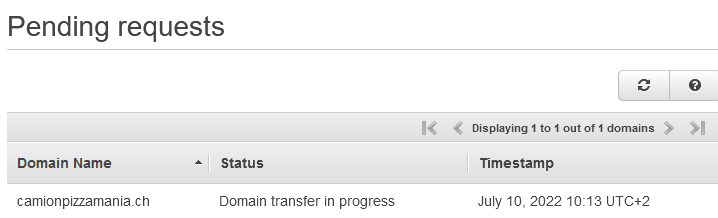
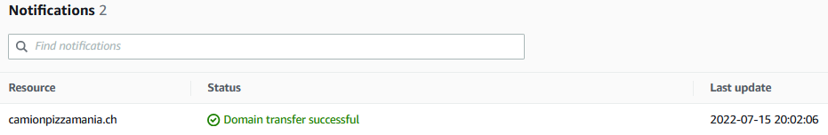

# Domain transfert

Originally, the registration for camionpizzmania.ch have been done through *cpnv* account.

To transfer the domain to the route53 owner by support-it@camionpizzamania.ch, we proceeded like this.

## Transfert domain to another AWS account

* [AWS Doc](https://docs.aws.amazon.com/Route53/latest/APIReference/API_domains_TransferDomainToAnotherAwsAccount.html)
* [AWS Cli doc](https://docs.aws.amazon.com/cli/latest/reference/route53domains/transfer-domain-to-another-aws-account.html)

```
[Input]
aws route53domains transfer-domain-to-another-aws-account --domain-name camionpizzamania.ch --account-id 842395284362 --region us-east-1

[Output]
{
    "OperationId": "e77bd9ba-ff49-49cc-9480-********",
    "Password": "**************"
}
```




## Accept domain transfer from another AWS account

* [AWS Doc](https://docs.aws.amazon.com/Route53/latest/APIReference/API_domains_AcceptDomainTransferFromAnotherAwsAccount.html)
* [AWS Cli doc](https://docs.aws.amazon.com/cli/latest/reference/route53domains/accept-domain-transfer-from-another-aws-account.html)

```
[Input]
aws route53domains accept-domain-transfer-from-another-aws-account --domain-name camionpizzamania.ch --password "********" --region us-east-1 --profile CAMION_PIZZA_MANIA

[Output]
{
    "OperationId": "fa9a7782-a36d-47b9-8c56-*********"
}
```

